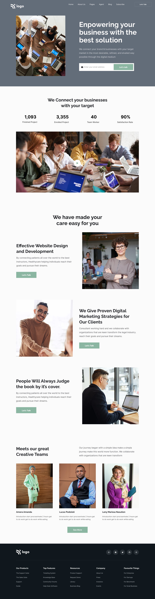

# Business Landing Page

  

### [Live Preview](https://landing-page-project-12.vercel.app/) :link:

## Project Goal :dart:

To make the landing page for an imaginary business and mockup was provided.

## Skills Gained

- Using `object-fit` property to format images.

## Time Taken

```
6 Hours
```

## Intended Outcome:



> This project is part of full stack Javascript web-dev bootcamp hosted by [iNeuron.](https://ineuron.ai/)
